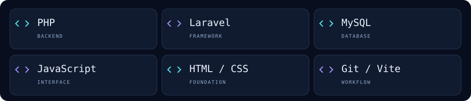

<picture>
  <source media="(prefers-color-scheme: dark)" srcset="assets/hero-dark.svg">
  <source media="(prefers-color-scheme: light)" srcset="assets/hero-light.svg">
  
</picture>

<p align="center">
  <a href="#01--about">ABOUT</a> &nbsp; / &nbsp;
  <a href="#02--toolkit">TOOLKIT</a> &nbsp; / &nbsp;
  <a href="#03--selected-work">PROJECTS</a> &nbsp; / &nbsp;
  <a href="#04--activity">ACTIVITY</a> &nbsp; / &nbsp;
  <a href="#05--connect">CONNECT</a>
</p>

## 01 / About

**Hi, I'm Qiu — also known as BoringDev.**

I build web applications that bring everyday workflows into focus: scheduling, booking, and the APIs behind them. I enjoy clean interfaces, thoughtful details, and a little futuristic energy.

```text
$ cat developer.config
focus      → web applications · backend APIs · interface design
building   → scheduling tools & booking experiences
design     → clear structure · subtle motion · purposeful detail
mindset    → build, learn, refine
```

<details>
<summary><b>Versi Bahasa Indonesia</b></summary>

Saya mengembangkan aplikasi web untuk membantu kebutuhan sehari-hari, mulai dari pengelolaan jadwal hingga pemesanan lapangan. Saya menyukai antarmuka yang rapi, detail yang dipikirkan dengan baik, dan sentuhan futuristik.

</details>

## 02 / Toolkit

<picture>
  <source media="(prefers-color-scheme: dark)" srcset="assets/toolkit-dark.svg">
  <source media="(prefers-color-scheme: light)" srcset="assets/toolkit-light.svg">
  
</picture>

Technologies used across my public projects. Always learning through building.

## 03 / Selected work

### [01 — Qiu's Schedule ↗](https://github.com/QiuuDev/Qiu_Schedule)

**A clearer rhythm for everyday plans.** A PHP scheduling application with authentication, profile management, notifications, and an analytics dashboard.

`PHP` · `MySQL` · `JavaScript` &nbsp; **[Explore project →](https://github.com/QiuuDev/Qiu_Schedule#readme)**

### [02 — Booking Badminton ↗](https://github.com/QiuuDev/booking-badminton)

**From an available court to a confirmed booking.** A Laravel API project documenting JWT authentication, court reservations, payment verification, and activity logs.

`Laravel` · `PHP` · `MySQL` · `JWT` &nbsp; **[Read the API docs →](https://github.com/QiuuDev/booking-badminton#readme)**

<details>
<summary><b>Explore the rest of the workspace</b></summary>

- [Badminton API](https://github.com/QiuuDev/badminton-api) — another part of my badminton booking experiments.
- [Badminton Booking](https://github.com/QiuuDev/badminton-booking) — a PHP project in the same domain.
- [All public repositories](https://github.com/QiuuDev?tab=repositories) — projects, experiments, and work in progress.

</details>

## 04 / Activity

<a href="https://github.com/QiuuDev?tab=repositories">
<picture>
  <source media="(prefers-color-scheme: dark)" srcset="assets/activity-dark.svg">
  <source media="(prefers-color-scheme: light)" srcset="assets/activity-light.svg">
  
</picture>
</a>

<a href="https://github.com/QiuuDev?tab=overview">
<picture>
  <source media="(prefers-color-scheme: dark)" srcset="assets/contributions-dark.svg">
  <source media="(prefers-color-scheme: light)" srcset="assets/contributions-light.svg">
  
</picture>
</a>

<sub>Generated from GitHub data. Repository statistics cover public repositories; contribution counts reflect the calendar returned by GitHub. [Update status](https://github.com/QiuuDev/QiuuDev/actions/workflows/profile.yml).</sub>

## 05 / Connect

Explore a project, open an issue with an idea, or follow along as I build.

**[Browse my work ↗](https://github.com/QiuuDev?tab=repositories)** &nbsp; · &nbsp; **[Start a project conversation ↗](https://github.com/QiuuDev/Qiu_Schedule/issues)**

<picture>
  <source media="(prefers-color-scheme: dark)" srcset="assets/footer-dark.svg">
  <source media="(prefers-color-scheme: light)" srcset="assets/footer-light.svg">
  
</picture>
